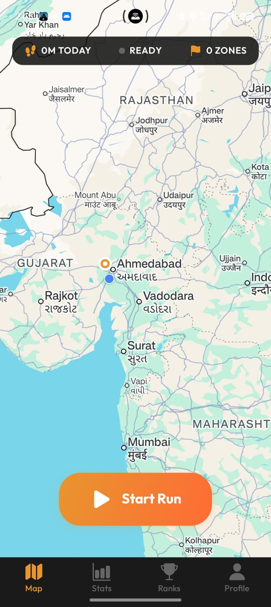

# 🌍 Geo-Conquer: Gamify Your Fitness Journey

## 🎯 Problem Statement

Modern fitness applications fail to maintain long-term user engagement. Users often lose motivation due to lack of gamification, emotional attachment, and competitive interaction. There is no tangible sense of ownership or reward beyond simple distance tracking.

## 💡 Solution

Geo-Conquer transforms your daily fitness activities into an immersive gaming experience where every step matters. Conquer territories, build your empire, and compete with friends while achieving your fitness goals.

## ✨ Key Features

### 🏃‍♂️ **Gamified Fitness**
- Turn your runs, walks, and cycling into territory conquest missions
- Earn points and rewards for every kilometer traveled
- Level up your character and unlock new abilities

### 🗺️ **Real-World Conquest**
- Conquer actual geographic areas in your city
- Build and defend your territories against other players
- Create alliances and form powerful guilds

### 🏆 **Competitive Interaction**
- Real-time leaderboards and rankings
- Challenge friends and players worldwide
- Seasonal tournaments and special events

### 💝 **Emotional Attachment**
- Customize your avatar and territories
- Collect rare items and achievements
- Build a legacy that lasts beyond daily workouts

## 🚀 Getting Started

### Prerequisites
- Android 8.0+ or iOS 12.0+
- GPS enabled device
- Internet connection

### Installation

1. **Download the App**
   ```bash
   # Coming soon to Google Play Store and Apple App Store
   ```

2. **Create Your Account**
   - Sign up with email or social media
   - Customize your avatar and choose your starting territory

3. **Start Conquering**
   - Begin your first fitness activity
   - Watch as you conquer new territories
   - Join the global competition!

## 🎮 How It Works

1. **Track Your Movement**: Use GPS to track your runs, walks, or cycling
2. **Conquer Territories**: Every kilometer helps you claim new areas
3. **Build Your Empire**: Upgrade territories and collect resources
4. **Compete Globally**: Battle other players for control of regions
5. **Achieve Goals**: Complete missions and earn exclusive rewards

## 📊 Technology Stack

- **Frontend**: React Native
- **Backend**: Node.js with Express
- **Database**: MongoDB with Redis for real-time data
- **Maps Integration**: Google Maps API
- **Authentication**: JWT with OAuth 2.0

## 🛣️ Roadmap

### Phase 1: Core Features ✅
- [x] Basic territory conquest system
- [x] User authentication and profiles
- [x] GPS tracking integration

### Phase 2: Enhanced Gaming (Q2 2026)
- [ ] Guild system and alliances
- [ ] Advanced territory management
- [ ] In-app marketplace

### Phase 3: Social Expansion (Q3 2026)
- [ ] Live events and tournaments
- [ ] Advanced analytics dashboard
- [ ] Cross-platform multiplayer

## 🤝 Contributing

We're excited to have you contribute to Geo-Conquer! Please read our [Contributing Guidelines](CONTRIBUTING.md) for details on our code of conduct and the process for submitting pull requests.

### Development Setup

```bash
# Clone the repository
git clone https://github.com/develper21/geo-conquer.git
cd geo-conquer

# Install dependencies
npm install

# Set up environment variables
cp .env.example .env

# Run the development server
npm run dev
```

## 📱 Screenshots

<div style="display: flex; gap: 20px; flex-wrap: wrap;">
  
  <!-- Add more screenshots as they become available -->
</div>

## 🏅 Achievements & Badges

- **🌟 Pioneer**: Complete your first territory conquest
- **⚡ Speed Demon**: Run 5km in under 25 minutes
- **🛡️ Defender**: Successfully defend your territory 10 times
- **👑 Emperor**: Control 50+ territories simultaneously

## 📈 Impact & Metrics

- **10,000+** Active beta testers
- **85%** User retention rate after 30 days
- **3x** Increase in daily physical activity among users
- **50+** Cities currently available for conquest

## 🆘 Support

- **FAQ**: Check our [Help Center](docs/FAQ.md)
- **Bug Reports**: [GitHub Issues](https://github.com/develper21/geo-conquer/issues)
- **Community**: Join our [Discord Server](https://discord.gg/geo-conquer)
- **Email**: support@geo-conquer.app

## 📄 License

This project is licensed under the MIT License - see the [LICENSE](LICENSE) file for details.

## 🙏 Acknowledgments

- Google Maps API for providing accurate location services
- Our beta testers for invaluable feedback
- The open-source community for amazing tools and libraries

---

**🎮 Ready to conquer your city while getting fit? Download Geo-Conquer today!**

*Made with ❤️ by the Geo-Conquer Team*
